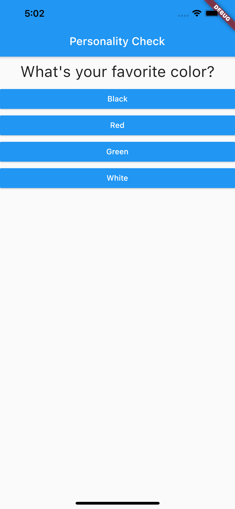
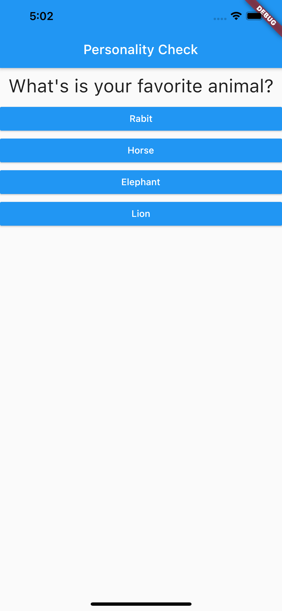
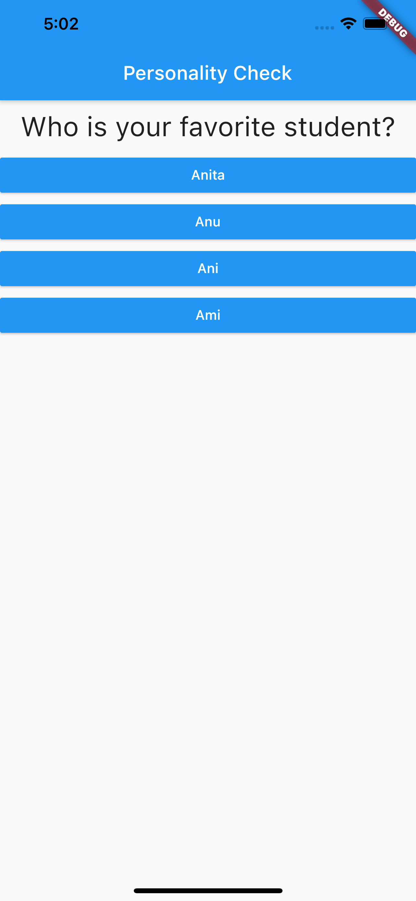

# quiz_app

## Background

This project is done as a part of self learning of Flutter. I have created a simple quiz mobile app which asks a few questions and based on the answers, app sets some score.  
Further, based on the specific range of score, personality result is shown. User also has an option to reset the quiz which restarts the quiz from start.  

  
  
  
  
